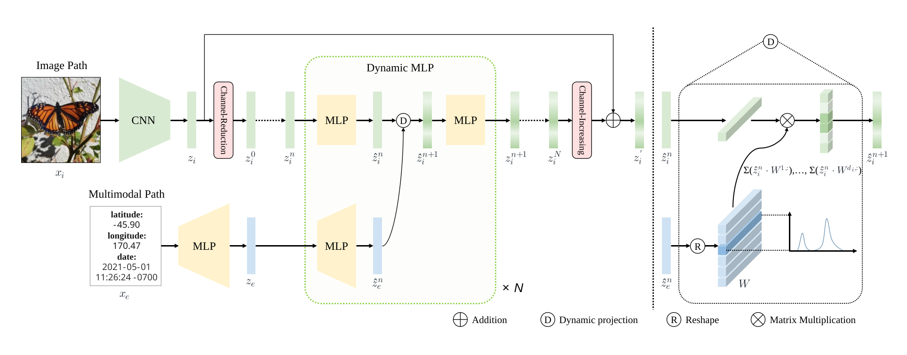

# DynamicMLP — NIA29 물류 이미지 분류 (fork)

원본 프로젝트: [Dynamic MLP for Fine-Grained Image Classification by Leveraging Geographical and Temporal Information](https://github.com/ylingfeng/DynamicMLP) ([논문](https://arxiv.org/pdf/2203.03253.pdf))

<p align="center"> </p>

> 본 저장소는 원본(iNaturalist 생물 분류용)을 **한국 NIA 29차 물류 이미지 데이터(택배/바코드, KAN_code 기준 107개 클래스)** 분류용으로 개조한 fork입니다. 메타데이터로 위도/경도/날짜 대신 **상품의 물리적 가로/세로 크기(width/height)** 를 Dynamic MLP의 조건 입력으로 사용합니다.

- **입력**: 224×224 RGB 이미지 + 4차원 메타데이터(sin/cos 인코딩된 width/height)
- **출력**: KAN_code 앞 4자리 기준 107개 클래스
- **백본**: SK-Res2Net-101 + Dynamic MLP (variant C)

---

## Requirements

### 가상환경 (로컬 Windows)

```bash
python -m venv .venv
.\.venv\Scripts\Activate.ps1   # PowerShell
pip install torch torchvision --index-url https://download.pytorch.org/whl/cu128
pip install numpy pillow tqdm scikit-learn matplotlib thop
```

### Linux 서버 (소스만 전송 후 실행)

```bash
# RTX 50xx (Blackwell) — CUDA 12.8
pip install -r requirements.txt --index-url https://download.pytorch.org/whl/cu128

# RTX 30xx/40xx — CUDA 12.1
pip install -r requirements.txt --index-url https://download.pytorch.org/whl/cu121

# CPU 전용
pip install -r requirements.txt --index-url https://download.pytorch.org/whl/cpu
```

> `requirements.txt` 헤더 주석에 CUDA 버전별 설치 방법이 정리되어 있습니다.

### 검증된 환경

- Python 3.14.6, PyTorch 2.11.0+cu128, torchvision 0.26.0+cu128
- GPU: NVIDIA GeForce RTX 5060 Laptop GPU (Blackwell, capability 12.0)

### 사전학습 가중치

SK-Res2Net-101 ImageNet 사전학습 가중치를 `checkpoints/` 에 배치:
```
checkpoints/sk2res2net101_epoch_300.pth
```
다운로드 링크: `checkpoints/README.md` 참조.

> **주의**: `models/sk2res2net_dynamic_mlp.py`의 사전학습 경로가 `/workspace/PRETRAINS/...`로 하드코딩 → 로컬 경로로 수정 필요.

---

## 데이터 준비

### 1. 원본 데이터 구조 (samples/)

```
samples/
  01.원천데이터/          ← 이미지 (.jpg)
    01_입고물품/01_가공식품/01_조미료/01010110_8809251219122/
      01010110_8809251219122_1_1.jpg
  02.라벨링데이터/        ← 어노테이션 (.json, 동일 폴더 구조)
    01_입고물품/01_가공식품/01_조미료/01010110_8809251219122/
      01010110_8809251219122_1_1.json
```

### 2. 재분포 (samples → datasets)

```bash
# 입고물품 (기본값): samples/ → datasets/, 8:2 분할
python prepare_data.py --clean

# 출고물품
python prepare_data.py --category outbound --clean

# 소스 경로를 세미콜론(;)으로 여러 개 지정 가능
python prepare_data.py --src "samples;D:/more_samples;E:/extra" --clean

# 분할 결과만 확인 (복사 없음)
python prepare_data.py --dry_run

# 분할 비율 변경
python prepare_data.py --val_ratio 0.15 --seed 42
```

**`--src` 다중 소스**: 세미콜론으로 구분된 여러 경로를 스캔하여 병합. 동일 상품 폴더명이 여러 소스에 중복될 경우 `(src, folder)` 키로 중복 제거.

**`--category`**:
| 값 | 의미 | 대상 폴더 |
|---|---|---|
| `inbound` (기본) | 입고물품 | `01_입고물품` |
| `outbound` | 출고물품 | `02_출고물품` |

### 3. 학습용 데이터 구조 (datasets/)

```
datasets/
  train/          ← 학습 이미지 (평면 구조)
  train_ann/      ← 학습 어노테이션
  tta/            ← 검증 이미지  ※ val/이 아니라 tta/ 임
  tta_ann/        ← 검증 어노테이션
```

> 입고/출고 모델은 동일 `datasets/` 경로를 공유하므로 카테고리 전환 시 `--clean` 필수.

---

## Train the model

### Windows 로컬 디버깅 (소량 데이터)

```bash
python train.py --name sk2_dynamic_mlp --data NIA29_input --data_dir datasets --model_file sk2res2net_dynamic_mlp --model_name sk2res2net101 --batch_size 8 --num_workers 0 --start_lr 0.01 --stop_epoch 3 --warmup 1
```

> Windows에서는 `--num_workers 0` 권장. GPU 자동 감지 (CUDA 있으면 GPU, 없으면 CPU).

### Linux 서버 본 학습 (전체 데이터)

```bash
CUDA_VISIBLE_DEVICES=0,1,2,3 python3 train.py \
  --name sk2_dynamic_mlp \
  --data NIA29_input \
  --data_dir /path/to/datasets \
  --model_file sk2res2net_dynamic_mlp \
  --model_name sk2res2net101 \
  --pretrained \
  --batch_size 512 \
  --num_workers 32 \
  --start_lr 0.04 \
  --stop_epoch 100 \
  --warmup 2
```

### image-only 모델 (Dynamic MLP 미사용, 비교용)

```bash
python train.py --name sk2_image_only --data NIA29_input --data_dir datasets \
  --model_file sk2res2net --model_name sk2res2net101 --pretrained --image_only \
  --batch_size 512 --start_lr 0.04
```

---

## Test the model

```bash
# 간단 평가 (Top-1/Top-5/loss)
python train.py --name sk2_dynamic_mlp --data NIA29_input --data_dir datasets \
  --model_file sk2res2net_dynamic_mlp --model_name sk2res2net101 \
  --resume logs/NIA29_input/sk2_dynamic_mlp/fold1_best.pth --evaluate

# 상세 평가 (confusion matrix, 클래스별 로깅)
python eval.py --name sk2_dynamic_mlp --data NIA29_input --data_dir datasets \
  --model_file sk2res2net_dynamic_mlp --model_name sk2res2net101 \
  --resume logs/NIA29_input/sk2_dynamic_mlp/fold1_best.pth --evaluate
```

---

## Model Zoo (iNaturalist 2021 mini, 90 epoch — 원본)

| Backbone       | Size  |   Acc@1    |                                      Log                                      |                                                                     Download                                                                     |
| -------------- | :---: | :--------: | :---------------------------------------------------------------------------: | :----------------------------------------------------------------------------------------------------------------------------------------------: |
| ResNet-50      |  224  |   67.924   |    [log](logs/log_inat21-mini_90epoch_r50_image-only_67.924_top1_acc.txt)     |    [model](https://github.com/ylingfeng/DynamicMLP/releases/download/v0.0/checkpoint_inat21-mini_90epoch_r50_image-only_67.924_top1_acc.pth)     |
| + Dynamic MLP  |  224  | **78.751** |   [log](logs/log_inat21-mini_90epoch_r50_dynamic-mlp-c_78.751_top1_acc.txt)   |   [model](https://github.com/ylingfeng/DynamicMLP/releases/download/v0.0/checkpoint_inat21-mini_90epoch_r50_dynamic-mlp-c_78.751_top1_acc.pth)   |
| SK-Res2Net-101 |  224  |   76.102   |  [log](logs/log_inat21-mini_90epoch_sk2-101_image-only_76.102_top1_acc.txt)   |  [model](https://github.com/ylingfeng/DynamicMLP/releases/download/v0.0/checkpoint_inat21-mini_90epoch_sk2-101_image-only_76.102_top1_acc.pth)   |
| + Dynamic MLP  |  224  | **84.694** | [log](logs/log_inat21-mini_90epoch_sk2-101_dynamic-mlp-c_84.694_top1_acc.txt) | [model](https://github.com/ylingfeng/DynamicMLP/releases/download/v0.0/checkpoint_inat21-mini_90epoch_sk2-101_dynamic-mlp-c_84.694_top1_acc.pth) |

---

## 문서

- [AGENTS.md](AGENTS.md) — 프로젝트 전체 구조·실행 방법·주의사항 (AI 작업용 참조 문서)
- [docs/학습및검증절차.md](docs/학습및검증절차.md) — 단계별 학습/검증 가이드
